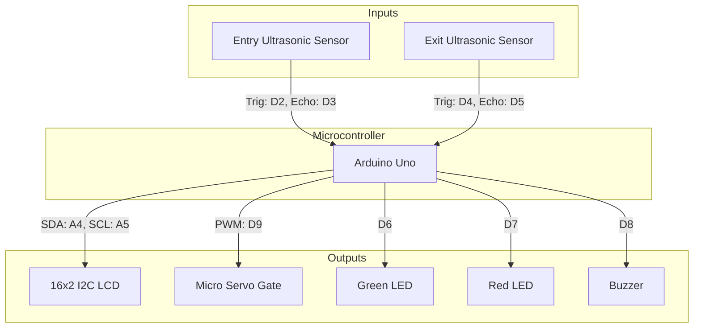
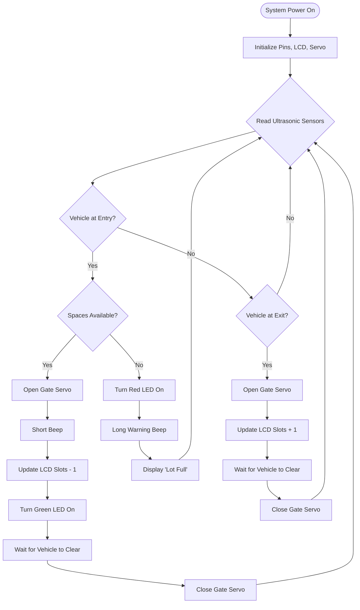

# 🚗 Smart Parking System - Weekly Mini Hackathon 🏆

Welcome to the definitive repository for the **Smart Parking System** project. This document serves as the master blueprint for the team's weekly mini hackathon effort. It is imperative that all team members adhere strictly to the architecture, pinout, and workflows defined below.

---

## 👥 Team Structure & Workflow

To maintain a streamlined and conflict-free development process, team roles are strictly segregated.

*   **Yahia Mahmoud (Leader)** 👑
    *   **Role:** System Architecture & Integration.
    *   **Responsibilities:** Oversees the overall project structure, dictates hardware-software boundaries, manages repository standards, and ensures all components integrate flawlessly.
*   **Omar** 💻
    *   **Role:** Embedded Software Engineer.
    *   **Responsibilities:** Exclusively writes the logic in the `.ino` format. All code must be placed solely in the `code/` folder (`code/smart_parking.ino`). Must strictly follow the hardware pinout mapping.
*   **Raneem** 🔌
    *   **Role:** Hardware Simulation Engineer.
    *   **Responsibilities:** Exclusively builds and wires the Tinkercad circuit. The final simulation link must be placed in the `simulation/link.txt` file. Must strictly adhere to the hardware pinout mapping.

---

## 🔍 Deep-Dive System Architecture

The Smart Parking System is a fully automated, state-machine driven embedded solution designed to manage vehicle entry, track available parking slots, and provide real-time user feedback. 

### 1. Initialization State
Upon power-up, the Arduino initializes all GPIO pins according to the master pinout. The LCD clears and displays a welcome message ("Smart Parking System"). The servo motor (barrier gate) is set to the closed position (0 degrees). The internal slot counter is set to the maximum capacity. The Green LED is turned OFF, and the Red LED is turned ON if the lot is full, otherwise, the Green LED is ON.

### 2. Entry Sequence
1.  **Vehicle Detection:** The Entry Ultrasonic Sensor continuously pings. When a vehicle approaches within the threshold distance (e.g., < 10 cm), the system triggers the entry sequence.
2.  **Capacity Check:** The Arduino evaluates the current available parking slots.
3.  **Access Granted (Space Available):**
    *   The Green LED illuminates.
    *   The LCD updates to display "Access Granted" and the new available slot count.
    *   The Servo motor rotates to 90 degrees to open the barrier.
    *   A short, high-pitched beep emits from the Buzzer to confirm entry.
    *   The system delays to allow the vehicle to pass.
    *   The Servo returns to 0 degrees (gate closes).
4.  **Access Denied (Lot Full):**
    *   The Red LED flashes.
    *   The LCD displays "Lot Full! Wait."
    *   The Buzzer emits a long, low-pitched warning tone.
    *   The barrier gate remains closed.

### 3. Exit Sequence
1.  **Vehicle Departure:** A secondary exit sensor (or a combined sensor logic depending on the final Tinkercad design) detects a vehicle leaving.
2.  **Slot Deallocation:** The Arduino increments the available slot counter.
3.  **Feedback & Actuation:** 
    *   The Servo opens the gate to allow exit.
    *   The LCD updates the total available slots.
    *   The gate closes once the vehicle has cleared the sensor zone.

### 4. Error Handling & Edge Cases
*   **Sensor Malfunction/Noise:** The system implements a software debounce mechanism (taking multiple readings and averaging) to prevent false positives from the ultrasonic sensors.
*   **Tailgating Prevention:** The gate closure sequence is tightly coupled to the sensor reading; if a second vehicle is detected immediately, the system evaluates capacity before allowing passage.

---

## 📍 Hardware Pinout Mapping (CRITICAL)

**ATTENTION OMAR AND RANEEM:** This pinout is locked. You must wire the Tinkercad circuit and code the Arduino sketch exactly as specified in this table to guarantee integration success.

| Component | Arduino Pin / Connection | Notes |
| :--- | :--- | :--- |
| **LCD Display (I2C)** | SDA -> A4, SCL -> A5 | Use I2C module. Address typically 0x27 or 0x3F. |
| **Entry Ultrasonic (Trig)** | Digital Pin 2 | Generates the ultrasonic pulse. |
| **Entry Ultrasonic (Echo)** | Digital Pin 3 | Receives the reflected pulse. |
| **Exit Ultrasonic (Trig)** | Digital Pin 4 | Generates the ultrasonic pulse. |
| **Exit Ultrasonic (Echo)** | Digital Pin 5 | Receives the reflected pulse. |
| **Servo Motor (Barrier)**| Digital Pin 9 (PWM) | Controls gate physical position. |
| **Green LED (Available)** | Digital Pin 6 | Indicates space available or gate open. |
| **Red LED (Full)** | Digital Pin 7 | Indicates lot full or access denied. |
| **Buzzer** | Digital Pin 8 | Auditory feedback. |

---

## 📐 System Diagrams

### System Architecture Diagram

### Logic Flowchart

---

## ✅ Hackathon Evaluation Criteria Checklist

Our team will be evaluated against the following criteria. Ensure all boxes can be ticked before final submission:

- [ ] **Correctness (30%):** Does the system accurately detect vehicles, open the gate, and update the count without bugs?
- [ ] **Code Quality (20%):** Is Omar's code clean, well-commented, strictly adhering to the pinout table, and utilizing appropriate non-blocking logic (e.g., `millis()`) where necessary?
- [ ] **Reliability (15%):** Does Raneem's Tinkercad circuit run stably without short circuits, power draw issues, or sensor glitches?
- [ ] **GitHub Org (10%):** Are we maintaining a clean commit history? Are files correctly placed in `code/` and `simulation/` without unneeded clutter (e.g., no `docs/`)?
- [ ] **Documentation (10%):** Is this master README followed? Is the system architecture clearly understandable?
- [ ] **Creativity (5%):** Did we add any small, unexpected feature (e.g., a specific buzzer melody, custom LCD characters) that elevates the project?
